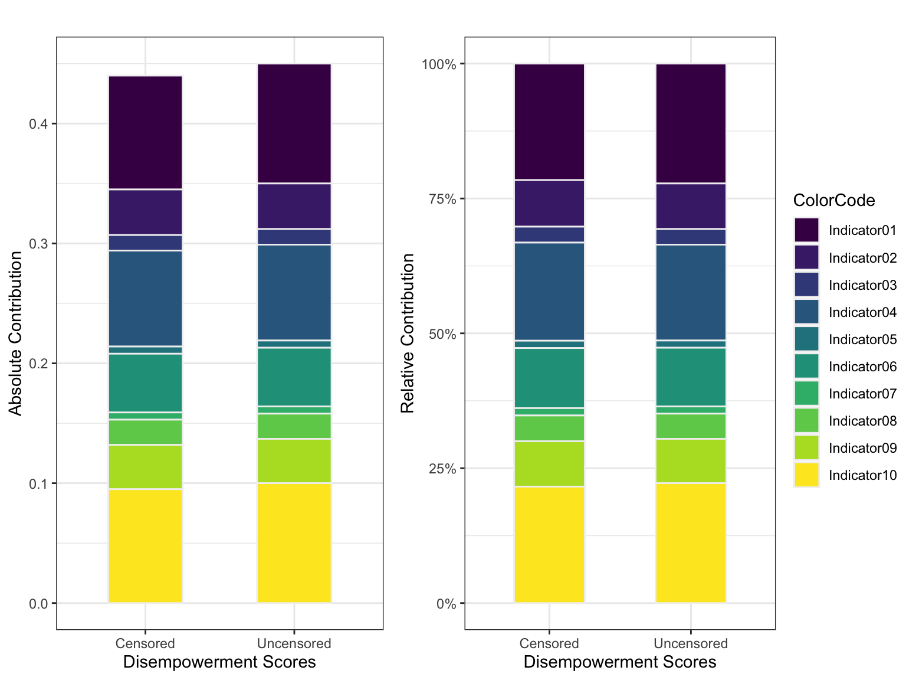

# Construction of indexes using R {-#title}

```{block, echo=TRUE}
<center>

<h3>Graphical Model for Indicator Contribution</h3> 



</center>
```


<!-- ```{block, type="tmbinfo", echo=TRUE} -->

<!-- 1. Method 1 focuses on the percentage of empowered women and adequacies among the disempowered.  -->
<!-- 2. Method 2 focuses on the percentage of disempowered women and the percentage of domains in which they lack adequate achievements.  -->

<!-- > Method 2 is commonly used as it is consistent with the M0 measurement (Alkire and Foster 2011). -->

<!-- * The disempowerment cut-off (k=20% ) is the percentage of weighted inadequacies a woman must have to be considered disempowered.  -->
<!-- * If ciw <= k the score is replaced by 0. -->
<!-- * Any existing inadequacies are not considered in the “Disempowered headcounts. -->
<!-- * Now the matrix has new column `ciwk` that contains censored inadequacy score. -->
<!-- ``` -->

```{r include=FALSE}
# automatically create a bib database for R packages
knitr::write_bib(c(
  .packages(), 'bookdown', 'knitr', 'rmarkdown', "tidyverse"), 'packages.bib')
```


