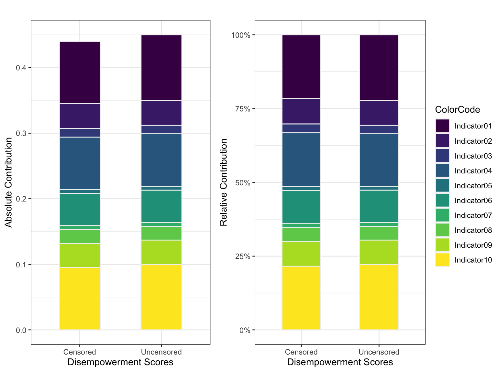

--- 
# title: "Empowerment in Agriculture"
# author: "Teresia Mrema Buza"
date: "Updated: `r Sys.time()`"
site: bookdown::bookdown_site
output: 
  bookdown::gitbook:
    config: 
      toc:
       collapse: section
      search: yes
      fontsettings:
        size: 2
    split_by: chapter
    # split_by: section
    includes:
      # before_body: headerbanner.html
      # after_body: footerbanner.html
    df_print: paged
    always_allow_html: true
css: [style.css, css/tmbbook.css, toc.css]
documentclass: book
bibliography: [book.bib, packages.bib, indexes.bib]
biblio-style: apalike
link-citations: yes
github-repo: tmbuza/indexbook
description: "Construction of indexes with R."
show_downloads: true
favicon: "favicon.ico"
---

# Introduction {-#intro}

```{block, type="", echo=TRUE}
<center>

## Graphical Model

**Indicator contribution to an index**

</center>


```


<!-- ```{block, type="tmbinfo", echo=TRUE} -->

<!-- 1. Method 1 focuses on the percentage of empowered women and adequacies among the disempowered.  -->
<!-- 2. Method 2 focuses on the percentage of disempowered women and the percentage of domains in which they lack adequate achievements.  -->

<!-- > Method 2 is commonly used as it is consistent with the M0 measurement (Alkire and Foster 2011). -->

<!-- * The disempowerment cut-off (k=20% ) is the percentage of weighted inadequacies a woman must have to be considered disempowered.  -->
<!-- * If ciw <= k the score is replaced by 0. -->
<!-- * Any existing inadequacies are not considered in the “Disempowered headcounts. -->
<!-- * Now the matrix has new column `ciwk` that contains censored inadequacy score. -->
<!-- ``` -->

```{r include=FALSE}
# automatically create a bib database for R packages
knitr::write_bib(c(
  .packages(), 'bookdown', 'knitr', 'rmarkdown', "tidyverse"), 'packages.bib')
```


